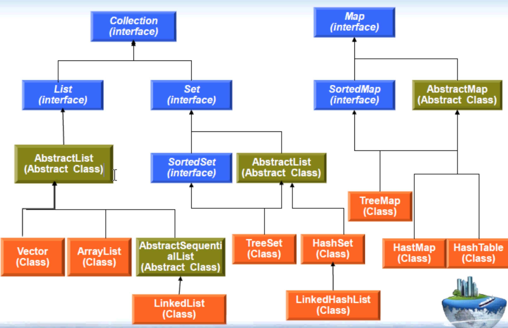

## 集合框架类

#### 11.1 为什么需要集合框架类

11.1.1 数组缺陷
	
		数组定长 
		
		数组只能存放本类和子类
		
#### 11.2 集合框架类

11.2.1 集合框架类特点
	
	集合框架类也是一个类  但是该类的对象内部可以存放很多其他类的对象
	
	集合框架类是变长的
	
	集合框架可以存放所有类型的变量
	
	集合框架提供优秀的算法 方便增删改查
	
	集合框架类在Java不止一个

11.2.2 集合
	
	将多个元素组成一个单元的对象
	
	用于存储 检索 操纵和传输数据

11.2.3 集合框架
	
	提供用于管理对象集合的接口和类
	
	包括接口 实现和算法
	

#### 11.3 集合框架体系结构

	1. collection <<interface>>  一个元素  util包中 继承接口Iterable
		
			List <<interface>>  元素有具体位置 可以有重复元素
		
			Set <<interface>>   元素没有具体位置 不允许重复的元素
			
				SortedSet <<interface>>
			
	2. Map <<interface>>  一个键名 一个键值  用于处理键值对  键不允许重复 值允许
		
		 SortedMap <<interface>>
	
		

11.3.1 collections

	contains(Object o)  是否包含指定的元素
	
	toArray()           返回此集合中所有的元素的数组
	
	size()              返回此集合的长度
	
	isEmpty()           集合内部是否为空  表示该集合已经分配堆内存 并非为null 只是其中还未存放元素 等价于 size等于0
	
	Iterator iterator() 返回在此collection的元素上进行迭代的迭代器
	
	add(Object o)       集合添加一个新对象  返回值 boolean
	
	addAll(Collection c)把一个集合内所有元素加入本集合 返回值 boolean
	
	remove(Object o)    集合删除一个新对象 返回值 boolean
	
	removeAll(Collection c)删除两个集合的交集 返回值 boolean
	
	clear()               清空集合内所有元素
	
	返回值 boolean 表示集合内部是否发生改变 改变包括元素的数量 元素的位置等变化 这个由具体实现类来实现
	
	
11.3.2 collection 与 collections的区别
	
		Collection 是集合类的上级接口 继承与他的接口主要有Set 和 List
	
	
		Collections 是针对集合类的一个帮助类 提供一系列静态方法实现和对各种集合的搜索 排序 线程安全化等操作
	
11.3.3 List

	List <<interface>>
		
		AbstractList (Abstract Class)
		
			Vector Class
			
			ArrayList Class
			
			AbstractSequentialList (Abstract Class)
				
				linkedList Class
				
	
	List list;
	
	list = new Vector();  Vector是线程安全的 性能上较ArrayList差
	
	list = new ArrayList();
	
	list = new LinkedList();  LinkedList的内部实现是链表 适合于需要频繁进行插入和删除操作
	
	线程安全: 同一时刻只有一个线程进行操作(根据线程优先级)

	线程不安全: 同一时刻有多个线程进行操作
	
#### 11.4 迭代器
	while形式:
	
	Iterator<Student> it = students.iterator()
	
	while(it.hasNext()) {
		Student stu = it.next();
	}
	
	for形式:
	
	for (Iterator<Student> it = students.iterator();  it.hasNext(); ) {
		Student stu = it.next();
	}
	
	forEach形式: 内部是迭代器
	
	for (Student stu : students) {
		println(stu);
	}
	
#### 11.5 Hashtable

	

#### 11.6 泛型  借鉴c #

	一般集合中存放一个类的对象 但是可以放多中类的对象 为了实现约束集合中只能放一个类的对象 就需要通过泛型
	
	泛型，即“参数化类型” 就是将类型由原来的具体的类型参数化，类似于方法中的变量参数
	
	此时类型也定义成参数形式（可以称之为类型形参），然后在使用/调用时传入具体的类型（类型实参）。

	泛型的本质是为了参数化类型（在不创建新的类型的情况下，通过泛型指定的不同类型来控制形参具体限制的类型）
	
	也就是说在泛型使用过程中，操作的数据类型被指定为一个参数，这种参数类型可以用在类、接口和方法中
	
	分别被称为泛型类、泛型接口、泛型方法。

	List<Student> students = new ArrayList<Student>();
	
	使用泛型后 数据不需要强转
	
	
#### 11.7 Map

