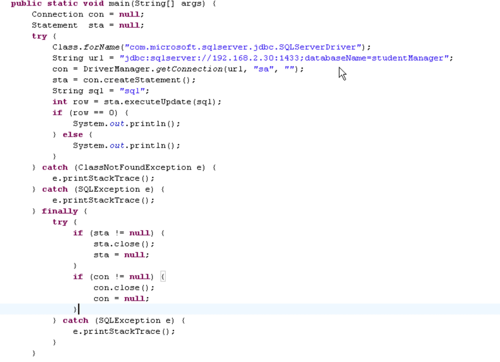

## JDBC

#### 12.1  什么是JDBC

12.1.1 概念

	java database connectivity
	
	是规范/标准
	
		Sun制定的Java应用程序链接数据库的规范/标准
	
	具体实现
	
		类和接口的集合
		

12.1.2 ODBC

	Open Database Connectivity
	
	开发式数据库连接
	
	是规范/标准
	
	Microsoft提供
	
	
12.1.2 三方关系

	1. JDBC 是规范制定者
	
	2. 数据库厂家实现规范 提供jar包
	
	3. 应用程序开发者
	
	
	1	--	2	实现
	
	1	--	3	学习
	
	2	--	3	使用
	
	JDBC是一个技术 通过它 我们就可以连接各种不同的数据库 执行各种操作--增删改查 还支持调用存储过程
	
	我们实际使用的时候是操作的如DriverManager这个类 如Connection Statement ResultSe这些t接口
	
	所以说 JDBC规范更具体点说是一些类和接口的集合
	
	
	Driver				接口		用来表示驱动程序类
	
	Connection  		接口		用来连接数据库
	
	Statement			接口		执行SQL语句并将数据检索到ResultSet中
	
	ResultSet   		接口		数据库结果集数据表 通常由执行查询数据库语句产生
	
	PreparedStatement   接口     执行预编译SQL语句
	
	
	Driver       生成       Connection
	
	Connection   生成       Statement
	
		Connection 对数据库建立的连接 
	
	Statement    生成       ResultSet
	
	Statement    执行SQL语句     通过驱动程序对于数据库操作
	
	通过驱动程序对于数据库操作 返回结果给    ResultSet
	

#### 12.2  JDBC使用

	12.2.1 导入相应的数据库jar包

	12.2.2 Class.forName() 静态方法  通过类名点方法调用
	
	12.2.3 DriverName根据连接数据库的种类不同所加载的驱动类不同 
		
		但不管是哪个类 他们一定实现java.sql.Driver接口 
		
		我们可以在驱动jar包里找到实现接口的相关类
		
		如sqlserver驱动类名com.microsoft.sqlserver.jdbc.SQLServerDriver
		
		如mysql驱动类名com.mysql.jdbc.Driver
		
		
		F4列出实现此接口的实现类
		
		Ctrl + T 列出笨接口的等级结构
		
	12.2.4 代码完成两个功能
	
		第一 把驱动程序加载到内存里
		
		第二 把当前加载的驱动程序自动去DriverName那注册
		
		JDBCManager是JDBC规范中唯一的Java类
		
	12.2.5 此方法会报一个编译时异常ClassNotFoundException 
	
		编译时异常处理 否则程序无法编译
		
		反正 如果项目包ClassNotFoundException 其后还会列出没有找到的类
		
		那大多是你没加载驱动程序的jar或类名写错了
		

#### 12.3 DriverManager

	12.3.1 
	
		DriverManager是JDBC规范中是类而不是接口
		
		它是一个服务类 用于管理JDBC驱动程序
		
		提供getConnection方法建立应用程序与数据库连接
		
		当JDBC驱动程序加载到内存时 会自动向DriverManager注册 
		
		此行代码发出请求 DriverManger类就会用注册JDBC驱动程序来创建到数据库连接
		
		
	12.3.2
	
		DriverManager.getConnection()是一个静态方法
		
	12.3.3 
	
		DriverManager在java.sql包里
		
		当我们调用sql包里任何一个类(包括接口)的任何一个方法时都会报一个编译时异常SQLException 
		
		使用Eclipse快捷键ctrl + l给出错误解决方案 这里可以使用trycatch
		
	12.3.4 
	
		方法参数URL 统一资源定位符
		
		端口号 sqlserver 1433 mysql 3306 oracle 1521
		
		sqlserver2005  jdbc:sqlserver://ip:1433;databaseName=dbName;
		
		mysql          jdbc:mysql://ip:3306/bName;
		
		oracle         jdbc:oracle:thin:@ip:1521:dbName;
		
		本机: 127.0.0.1 localhost
		

#### 12.4 Statement

	12.4.1 创建statement
	
		Statement sta = connection.createStatement();
		
	12.4.2 执行sql语句
	
		int row = sta.executeUpdate(sql);
		
		if (row == 1) {
			// 添加成功
			
		}

#### 12.5 ODBC OLEB ADO

	12.5.1 ODBC
	
		微软指定的应用程序连接数据库并执行SQL语句的规范
		
	12.5.2 OLEB
	
		OLEB是ODBC的升级
	
	12.5.3 ADO
	
		ADO是微软提供对规范的实现
		
		
#### 12.6 总结

	规范
		
		1 Driver接口
		
			连接数据库的驱动程序类
			
			Class.forName使用 加载数据库驱动程序
			
		2 DriverManager
		
			驱动程序管理者
		
			通过getDirvers方法 得到当前在此注册的所有数据库驱动程序的集合
			
				Enumeration<Driver> drivers = DriverManager.getDirvers();
		
	操作
		
		1. 给项目添加jar包
			
			直接添加
			
			在项目建立文件夹放入
		
		2. 加载驱动程序
			
			Driver接口所完成功能
			
		3. 得到连接
			
			Connection con = DriverManager.getConnection(url ,username, passward)	
			
			url = ip + port + dbName
			
		4. 得到statement
		
				Statement sta = con.createStatement();
				
		5. 执行sql语句
		
			DML: create insert  update delete
			
			DDL: Create drop 
			
				int row = sta.executeUpdate(sql语句);
				
					sql语句:
					
						DML insert update delete
						
						DDL create drop等										
					
				ResultSet rs = sta.executeQuery(select语句);
				
					rs里面有个指针指向第一条记录的之上的位置
					
						rs.next() 
							
							判断是否下一行
							
							如果有 则移动到下一行 并且返回true 否则false
							
							rs.getXXX 列名 下标(下标从1开始注意这个小特色) 都可以
							
							
				
		DML（data manipulation language）
		
		       它们是SELECT、UPDATE、INSERT、DELETE，就象它的名字一样，这4条命令是用来对数据库里的数据进行操作的语言
			   
		DDL（data definition language）
		
		       DDL比DML要多，主要的命令有CREATE、ALTER、DROP等，DDL主要是用在定义或改变表（TABLE）的结构，数据类型
			   
			   表之间的链接和约束等初始化工作上，他们大多在建立表时使用
			   
		6. 收尾 关闭操作
		
			sta.close()
			
			sta = null
			
			con.close()
			
			con = null
			

			
		
#### 12.7 桥接与直连

		

	