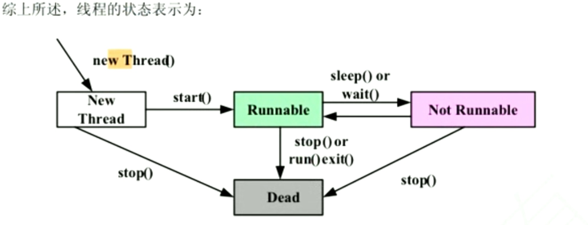

## 线程 thread

#### 14.1  程序 进程 线程

14.1.1 程序 静态
	
	对数据描述和操作代码的集合 是应用程序执行的脚本
	
14.1.2 进程 动态

	是程序的一次执行过程 是系统运行程序的基本单位
	
14.1.3 线程 动态

	是程序中相对独立的代码段 比进程更小的运行单位 一个或多个线程构成一个进程
	
14.1.4 进程与线程区别
	
	进程有独立CPU时间 + 内存空间
	
	线程没有独立CPU时间 + 内存空间

进程 | 线程
---- | ---
进程是由操作系统调度管理的 系统可以为一个程序创建多个进程 | 线程是由进程管理的  一个或多个线程构成一个进程
进程有自己的内存空间和cpu时间 |  线程没有自己的内存空间和cpu时间
基于进程的多任务程序独立开发 独立运行 但切换 通信的成本大 占用更多的资源 |  基于线程的多任务程序通讯与调用成本更少 但不能独立开发运行  

	不要自己去调用线程run方法 这样不会以多线程方法执行 
	
	而是以一个对象的方法普通运行  
	
	应该调用线程对象start方法
	
14.2 Runnable接口

	Java中是单继承 如果子类的父类不是Thread
	
	子类如果需要多线程的功能 这是可以通过实现Runnable接口
	
	Runnable接口是单方法接口  抽象方法run
	
	这时候使用Thread构造方法传参方式来完成 这个参数就是实现Runnable接口的子类
	

14.3 线程同步 死锁

	14.3.1 线程同步
	
		线程同步: 是为了保证当多个线程同时并发访问某资源时
		
		在任何指定时间只有一个线程可以访问该资源
		
		从而使该资源的数据保持一致 那么反过来说就是如果多个线程同时访问某一资源时 就有可能使数据不一致
		
	
	14.3.2 同步 synchromized
	
		同步分为 同步方法 和 同步块
		
		同步方法 只要在方法的声明前面加上synchromized关键字就可以了 
		
			原理:
			
				是在任何时刻一个对象中只有一个同步方法可以执行
			
				只有对象当前执行的同步方法结束后 同一个对象的另一个同步方法才可能开始运行 
			
				这里的思想是: 保证每个线程在调用对象同步方法时 以独占的方法操作对象
			
				这里同步利用了一种与每个对象相关的内部锁
		
				这种锁在同步方法开始执行时由进程设置一种标志 称为: 锁定
		
				对象的每个同步方法都检查是否另一个方法设置了该锁 如果设置了 此方法不执行
		
				直到该锁定由一解锁动作复位为止  这样同一时刻只能由一个同步方法执行 
				
				因为这个方法已经设置了锁 足赤了其他同步方法的启动
		
		
		同步块: 
		
			线程同步粒度越小越好 即线程同步的代码块越小越好 
			
			最初出现时为了让两个线程有时间同时修改一个资源数据
			
			synchromized(this) {  // this 声明同步的对象
				// code
			}
		
			同步影响的范围越小越好
			
			同步块后面需要传递同步的对象参数 所以它可以指定更多的对象享受同步的优势
			
			而不像同步方法那样只有包含相关代码的对象受益
			
		
		所以 单线程的时候不必要使用同步的方法和同步块
		
		14.3.3 死锁
		
			死锁
				
				产生原因:
					
					第一个线程等待第二个线程释放资源   第二个线程等待第一个线程释放资源
					
					导致死锁的根源是不恰当的使用同步方法 并且程序的运行轨迹没经过严密的考虑
					
				发生死锁一般要满足四个条件:
				
					1. 互斥条件       一个资源每次只能被一个线程使用
					
					2. 请求与保持条件  一个线程因请求资源而阻塞时候 对已多个资源保持不变  
					
					3. 不剥夺条件     线程已获得资源 在未使用完成前 不能强行剥夺
					
					4. 循环等待条件   若干线程之间形成一个多为相连的循环等待资源关系
					
					这四个条件是死锁的必要条件 只要系统发生死锁 这些条件必然成立 而只要上述条件之一不满足 就不会发生死锁
					
			Java本身不能预防死锁 也不能发现死锁 
			
			所以再知道死锁发生条件 根据条件避免死锁
			
		14.3.4 线程间通信
		
			原理:
				
				让当前锁定某对象的线程在线程体没执行完的情况下解锁  让其他的线程有机会执行刚才被锁定的同步方法
				
				当然执行完后要通知以前的线程继续执行
				
			线程通信主要是使用Object类提供的三个方法:
				
				wait()
					
					让当前线程放弃监视器并进入睡眠状态  知道其他线程进入同一监视器并调用notify()与notifyAll()来实现
				
				notify()
				
					唤醒方法 可唤醒同一对象监视器中调用了wait()方法的第一个线程
				
				notifyAll()
				
					唤醒线程所有方法 唤醒同一对象监视器中调用了wait()方法的所有线程 具有最高优先级的线程首先被唤醒
					
					
	14.4 主线程
	
		在Java启动时候 运行main 有一个线程立即执行 把该线程称为主线程
		
		主线程的重要性体现在两方面:
			
			它是产生其他子线程的线程
			
			通常它必须最后完成执行 因为它执行各种关闭动作
			
		打印线程信息 线程名 优先级 线程组名
		
	
	14.5 当前线程
	
		Thread.currentThread()
		
		.setNanme(newName);
	
	14.6 精灵线程/守护线程
	
			Java中有一中线程叫守护线程或精灵线程
			
			它通常在后台运行 是给用户线程提供支持服务
			
			特点是当程序中没有用户线程在运行的时候 它就停止执行
			
			.setDaemon(true) 将为守护线程
			
			垃圾回收线程就是一个典型守护线程 
			
			垃圾回收线程优先级为1 最低
	
	14.7 线程组
	
		所有线程都隶属于某个线程组 默认的是系统线程组
		
		我们可以在创建线程时设定它隶属于的线程组
		
		线程组也必须从属于其他线程组
		
		必须在构建器里指定新线程组从属于那个线程组
		
		若在创建一个线程组没有指定的归属 则自动归属于系统线程组
		
		因此一个应用程序中的所有线程包括线程组最终会成为以系统线程组为根节点的一棵树
		
		.getThreadGroup()
		
		.activeCount()  得到当前线程中活动的线程和线程组数目
		
		
	
	14.8 线程优先级
		
		对于高优先级 使用优先级执行的抢占式策略
		
		而对于同优先级的线程使用先进先出的队列 使用时间片策略
		
		Java中线程的优先级是在Thread类中定义的常量:
			
			NORM_PRIORITY      5  
			
			MAX_PRIORITY      10
			
			MIN_PRIORITY      1
			
		缺省的为NORM_PRIORITY
		
		通过setPriority() 与 getPriority()得到和设置当前线程的优先级
		
	14.9 线程状态
	
		线程的生命周期是指线程从创建运行到消亡的过程
		
		现在五个状态:
			
					 阻塞
			
			创建   就绪     运行   死亡
			
			1. 创建
			
				就是使用new关键字创建线程对象后 该对象就处于创建状态
				
			2. 就绪
				
				处于就绪状态的线程已经具备了运行的条件但还没分配到CPU资源
				
				只是根据自身优先级进入等待队列的相应位置 等待系统为其分配CPU 
				
				一旦获得CPU 线程就进入运行状态
				
			3. 运行
			
				得到CPU资源 拥有对CPU控制权 会顺序执行run方法的中代码
				
				直到或调用其他方法终止 或等待某些资源而阻塞
				
				或完成任务而死亡
				
			4. 阻塞
			
				进入运行状态的线程在某些情况下让出CPU并暂时终止自己的运行
				
				进入阻塞状态
				
				引起阻塞原因:
					
					1. 调用 sleep()方法
					
					2. 等待IO资源
					
				阻塞状态下线程不能进入就绪队列 只有引起阻塞的条件消除后才会再次进入就绪队列
				
			5. 死亡
				
				表示线程已经退出运行状态 并且不再进入就绪队列
				
				线程终止:
					
					1. 自然死亡 即线程体执行结束
					
					2. 被强制性终止
						
						destroy()
						
						stop()
						
						但是JDK1.5不建议使用这两个方法 因为如还没释放资源 有可能造成程序的死锁
						

	
	
				
	