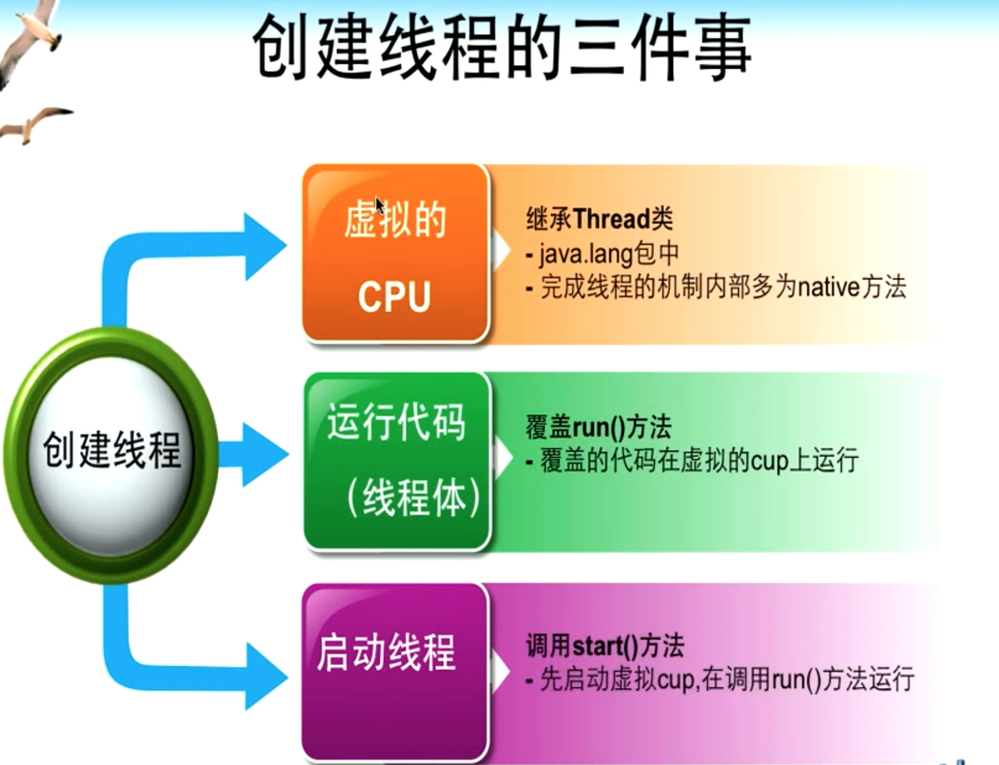

## 线程 thread

#### 14.1  程序 进程 线程

14.1.1 程序 静态
	
	对数据描述和操作代码的集合 是应用程序执行的脚本
	
14.1.2 进程 动态

	是程序的一次执行过程 是系统运行程序的基本单位
	
14.1.3 线程 动态

	是程序中相对独立的代码段 比进程更小的运行单位 一个或多个线程构成一个进程
	
14.1.4 进程与线程区别
	
	进程有独立CPU时间 + 内存空间
	
	线程没有独立CPU时间 + 内存空间

进程 | 线程
---- | ---
进程是由操作系统调度管理的 系统可以为一个程序创建多个进程 | 线程是由进程管理的  一个或多个线程构成一个进程
进程有自己的内存空间和cpu时间 |  线程没有自己的内存空间和cpu时间
基于进程的多任务程序独立开发 独立运行 但切换 通信的成本大 占用更多的资源 |  基于线程的多任务程序通讯与调用成本更少 但不能独立开发运行  

